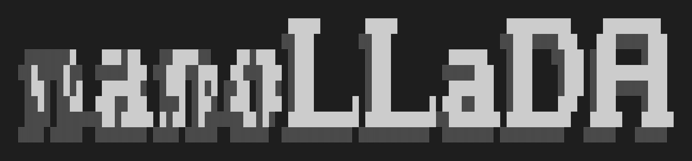

# 

A minimal implementation of [LLaDA](https://arxiv.org/abs/2502.09992) — the masked diffusion language model — built for learning and experimentation.

Part of the **nano** series, inspired by Karpathy's [nanoChat](https://github.com/karpathy/nanochat). ~500 lines of core code. Trains on 4 GPUs.


> **🚧 Early stage.** This repo covers **pretraining and generation** only. SFT, evaluation, and VRPO from the LLaDA paper are not yet implemented. Contributions welcome — we're all learning together!

**New to diffusion language models?** Check out [`tutorial.ipynb`](tutorial.ipynb) for a complete walkthrough — it downloads data, trains a tokenizer, trains a small model, and generates text, all from scratch.

## The Big Idea

GPT generates text left-to-right, one token at a time. LLaDA starts with all `[MASK]` tokens and **iteratively reveals them** — filling in the most confident predictions first, then refining with more context. It's a diffusion model, but for text.

The entire architectural difference from GPT is **one line**:

```python
# GPT:    y = F.scaled_dot_product_attention(q, k, v, is_causal=True)   # left-to-right
# LLaDA:  y = F.scaled_dot_product_attention(q, k, v, is_causal=False)  # bidirectional
```

The training loss is also different — mask random tokens, predict them, weight by `1/mask_ratio`:

```python
loss = CE(logits[masked], targets[masked]) / mask_ratio  # this makes it an ELBO
```

That's it. Everything else (RoPE, RMSNorm, ReLU² MLP) is identical to a standard transformer.

## Quick Start

```bash
bash run.sh  # downloads data, trains tokenizer, pretrains model
```

Or step by step:

```bash
uv venv && uv sync --extra gpu && source .venv/bin/activate
python -m nanollada.dataset -n 80          # download data
python -m scripts.tok_train                 # train tokenizer
torchrun --nproc_per_node=4 -m scripts.train  # pretrain
python -m scripts.inference --prompt "The capital of France is"  # generate
```

## Hardware Guide (4× NVIDIA L4, 23GB)

| Depth | Params | Batch/GPU | Memory | Throughput | Time (compute-optimal) |
|---|---|---|---|---|---|
| 4 | 20M | 32 | 9.8 GB | 127K tok/s | ~2 min |
| 12 | 135M | 16 | 11.1 GB | 143K tok/s | ~2.3 hours |
| 20 | 477M | 8 | 15.6 GB | 43K tok/s | ~4 days |
| 24 | 780M | 4 | 16.5 GB | 8K tok/s | very slow |

d12 for fast experiments, d20 for serious training.

## How It Works

**Training:** Randomly mask tokens (ratio `t ~ Uniform(0,1)`), predict them, loss = `CE / t`. The `1/t` weighting makes this an ELBO on the data likelihood — a proper generative model, not just BERT.

**Generation:** Start fully masked → run model → unmask the most confident predictions → repeat for N steps. Supports temperature sampling, semi-autoregressive blocks (`--block-length`), and classifier-free guidance (`--cfg-scale`).

## File Structure

```
nanollada/
  model.py        # Bidirectional transformer (is_causal=False)
  generate.py     # Iterative unmasking generation
  diffusion.py    # Forward process and training loss
  dataloader.py   # Distributed data loading
  dataset.py      # Dataset download (ClimbMix-400B)
  tokenizer.py    # BPE tokenizer with <|mask|> token
  checkpoint.py   # Save/load with auto-cleanup
  common.py       # Shared utilities (DDP, device detection)
scripts/
  train.py        # Pretraining (DDP, grad accum, checkpointing)
  inference.py    # Generate text from a checkpoint
  tok_train.py    # Train the tokenizer
tutorial.ipynb    # Interactive end-to-end walkthrough
```

## What's Missing

From the [LLaDA paper](https://arxiv.org/abs/2502.09992) and follow-ups:

- **SFT** — only mask the response, not the prompt ([guidelines](https://github.com/ML-GSAI/LLaDA/blob/main/GUIDELINES.md#sft))
- **Evaluation** — benchmarks like MMLU, GSM8K, HumanEval
- **VRPO** — preference alignment from [LLaDA 1.5](https://ml-gsai.github.io/LLaDA-1.5-Demo/)
- **Faster inference** — block diffusion, consistency distillation, caching

## References

- [LLaDA paper](https://arxiv.org/abs/2502.09992) — Large Language Diffusion Models
- [nanoChat](https://github.com/karpathy/nanochat) — the autoregressive baseline this was adapted from
- [SMDM](https://github.com/ML-GSAI/SMDM) — scaling laws for masked diffusion models
